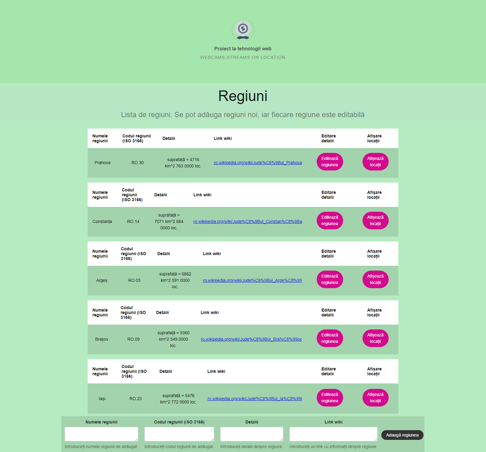
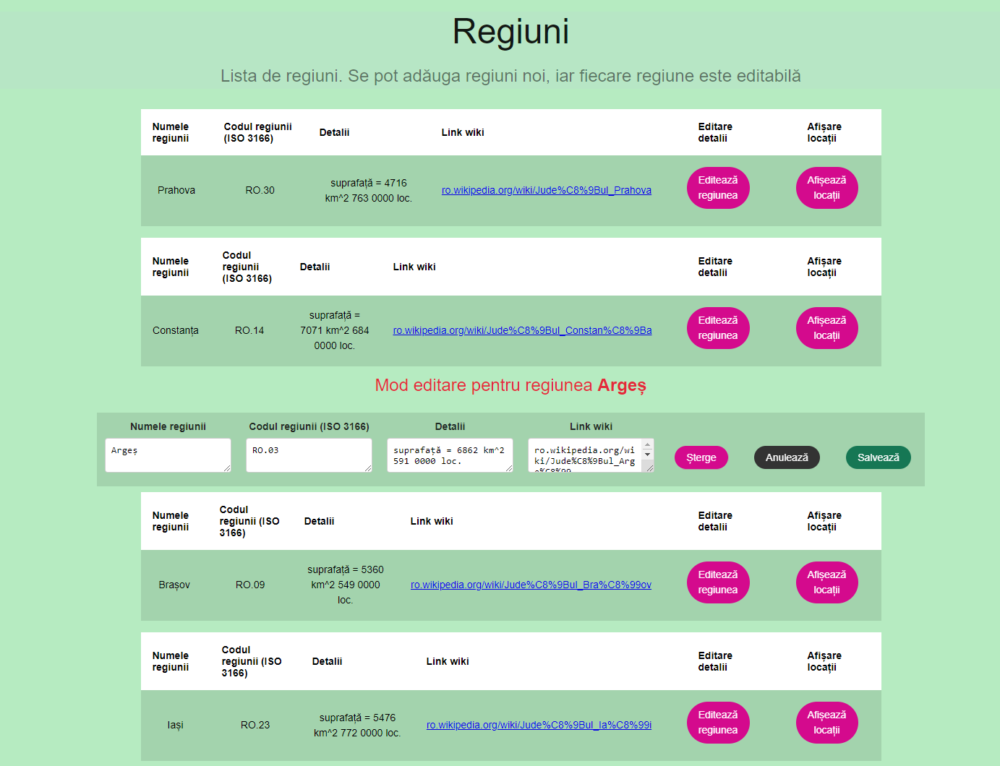
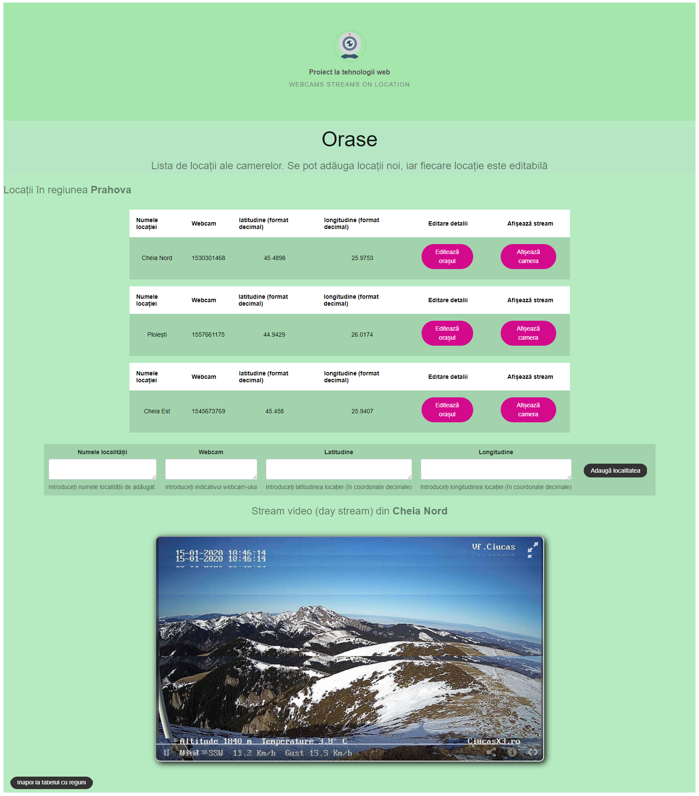
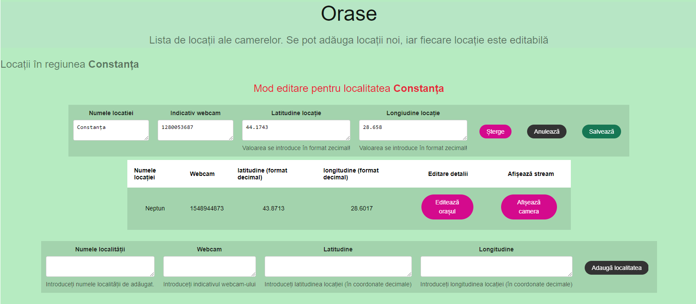
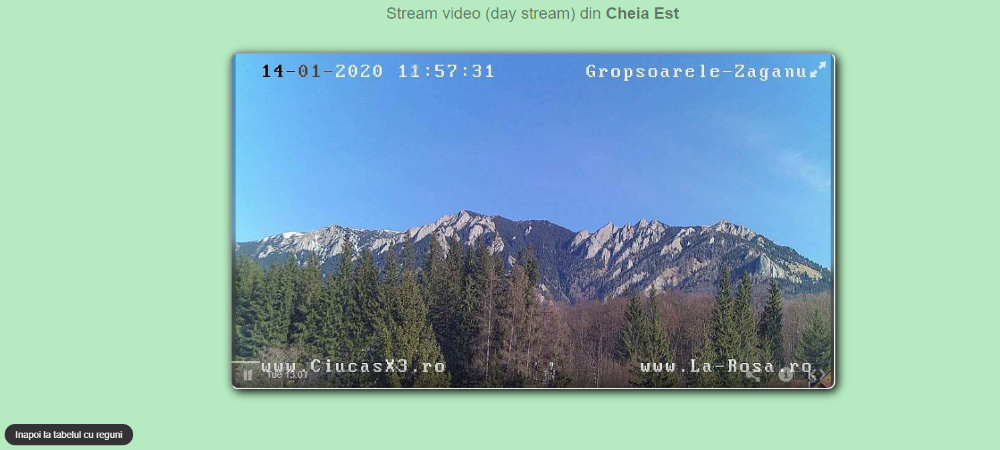

## Webcams project

- Using Javascript related technologies for a full stack web project:  
    - **React** - frontend
    - **Node JS** - backend
    - **MySQL** - persistence
    
The application displays sets of regions and cities from those regions (from Romania) using a MySQL database for persistence. Data is handled through an ORM (Sequelize). Using webcam's id, the application is displaying video streams from the selected city, provided by an external API (Webcams Travel). All necessary database operations (CRUD) are supported.

**Screenshots:**  

